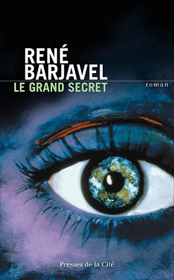

# Bonnes pratiques HTML Corrections des exercices 

## Exercice 1 Balises

### `<time>`

`<time>` représente soit une heure ou une date.
Il accepte deux attributs :

* `datetime` acceptant une date précise du calendrier grégorien, potentiellement accompagnée d'une heure et d'un fuseau horaire
* `pubdate`, attribut booléen indiquant que la date signalée est la date de publication du document

### `<fieldset>`

`<fieldset>` permet de regrouper au sein d'un formulaire web plusieurs contrôles formant un ensemble logique.
Il peut être accompagné d'un élément `legend`, placé comme premier enfant, permettant de donner un libellé au groupe.

### `<nav>`

`<nav>` représente une section d'une page ayant des liens vers d'autres pages ou des fragments de cette page.

### `<dfn>`

`<dfn>` représente le terme défini par une définition. La définition du terme doit être donnée par l'élément 
, ou <section> parent ou par un groupe de liste de définitions (généralement une paire <dt>, <dd>).

### `<main>`

`<main>` représente le contenu principal d'un document, unique au sein du site ou de l'application.

### `<section>`

`<section>` représente une section générique d'un document, c'est à dire un groupement thématique de contenu, généralement avec un en-tête.

### `<acronym>`

`<acronym>` identifie une suite de caractères composant un acronyme ou l'abréviation d'un mot au sein d'un texte. Cette balise est dépréciée et a été remplacée en HTML5 par la balise `<abbr>` dont le fonctionnement est identique. La signification de l'abbréviation ou de l'acronyme doit être indiquée via l'attribut `title`.

### `<article>`

`<article>` représente un contenu autonome dans un document, prévu pour être distribué ou réutiliser indépendamment (par exemple dans un flux de syndication).

### `<optgroup>`

`<optgroup>` permet de regrouper des options au sein d'un élément `<select>`.

### `<aside>`

`<aside>` identifie une section de la page dont le contenu est indirectement lié à ce qui l'entoure et qui pourrait être présentée indépendamment.

## Exercice 2 Balisage sémantique

    <article>
      <h1>Le Grand Secret</h1>
      <ul>
        <li>Publié en <time>1973</time></li>
        <li>
          Écrit par René Barjavel
          (
          <time datetime="1911-01-24">1911</time>
          -
          <time datetime="1985-11-24">1985</time>
          )
        </li>
        <li>ISBN 2-266-02304-7</li>
        <li>376 pages</li>
      </ul>
      
      
"Le Grand Secret", c'est l'histoire d'un couple séparé par un extraordinaire évènement,
      puis réuni dans des circonstances telles que jamais un homme et une femme n'en ont connu
      de pareilles. C'est aussi l'histoire d'un mystère qui, depuis 1955, a réuni, à l'insu de
      tous, dans une angoisse commune, par-dessus les oppositions des idéologies et des
      impérialismes, les chefs des plus grandes nations. C'est ce "grand secret" qui a mis fin à
      la guerre froide, qui a été la cause de l'assassinnat de Kennedy, qui rend compréhensible
      le comportement de De Gaulle en mai 1968, qui a rendu indispensables les voyages de Nixon
      à Moscou et à Pekin. Il n'a rien à voir avec la guerre ou la bombe H. C'est le secret de
      la plus grande peur et du plus grand espoir du monde. Il ne faut pas oublier que c'est un
      roman. Mais si c'était vrai ?…

    </article>

## Exercice 3 Microdonnées

    <article itemscope itemtype="http://schema.org/Book">
      <h1>Le Grand Secret</h1>
      <ul>
        <li>Publié en <time itemprop="dateCreated">1973</time></li>
        <li>
          Écrit par
          
            
              René
              Barjavel
            
            (
            <time datetime="1911-01-24" itemprop="birthDate">1911</time>
            -
            <time datetime="1985-11-24" itemprop="deathDate">1985</time>
            )
          
        </li>
        <li>ISBN 2-266-02304-7</li>
        <li>376 pages</li>
      </ul>
      
      
"Le Grand Secret", c'est l'histoire d'un couple séparé par un extraordinaire
      évènement, puis réuni dans des circonstances telles que jamais un homme et une femme n'en ont connu de
      pareilles. C'est aussi l'histoire d'un mystère qui, depuis 1955, a réuni, à l'insu de tous, dans une
      angoisse commune, par-dessus les oppositions des idéologies et des impérialismes, les chefs des plus
      grandes nations. C'est ce "grand secret" qui a mis fin à la guerre froide, qui a été la cause de
      l'assassinnat de Kennedy, qui rend compréhensible le comportement de De Gaulle en mai 1968, qui a rendu
      indispensables les voyages de Nixon à Moscou et à Pekin. Il n'a rien à voir avec la guerre ou la bombe H.
      C'est le secret de la plus grande peur et du plus grand espoir du monde. Il ne faut pas oublier que c'est
      un roman. Mais si c'était vrai ?…

    </article>

