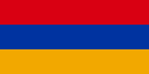
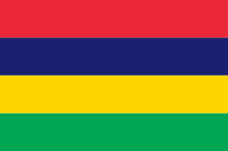
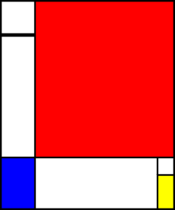

# \<canvas\> - Prise en main Exercices

## Exercice 1 Drapeaux

  <figure>
    
    <figcaption>Drapeau de la République d'Arménie</figcaption>
  </figure>

Dans un canvas de 960x600 pixels, reproduisez le drapeau de la République d'Arménie.

Modifier votre script pour encadrer le drapeau d'une bordure blanche de 5px d'épaisseur.

  <figure>
    
    <figcaption>Drapeau de la République de Maurice</figcaption>
  </figure>

Modifiez votre script pour reproduire le drapeau de la République de Maurice.

Modifiez à nouveau votre script pour pouvoir afficher aléatoirement n'importe lequel des drapeaux multicolores à bandes horizontales de même taille au monde au chargement de la page.

    var countries     = [
        ['#ed2939', '#ffffff', '#ed2939']             // Austria
      , ['#d90012', '#0033a0', '#f2a800']             // Armenia
      , ['#d52b1e', '#f9e300', '#007934']             // Bolivia
      , ['#ffffff', '#00966e', '#d62612']             // Bulgaria
      , ['#4891d9', '#000000', '#ffffff']             // Estonia
      , ['#009e60', '#fcd116', '#3a75c4']             // Gabon
      , ['#cd2a3e', '#ffffff', '#436f4d']             // Hungary
      , ['#ce1126', '#ffffff']                        // Idonesia
      , ['#ed2939', '#ffffff', '#00a1de']             // Luxembourg
      , ['#ce1126', '#ffffff']                        // Monaco
      , ['#ea2839', '#1a206d', '#ffd500', '#00a551']  // Mauricius
      , ['#ffffff', '#dc143c']                        // Poland
      , ['#ffffff', '#0039a6', '#d52b1e']             // Russia
      , ['#1eb53a', '#ffffff', '#0072c6']             // Sierra Leone
      , ['#005bbb', '#ffd500']                        // Ukraine
      , ['#ce1126', '#ffffff', '#000000']             // Yemen
                                                      // More ?
      ];

> Fonctions JavaScript utiles :
>
> * [`Math.floor`](https://developer.mozilla.org/fr/docs/JavaScript/R%C3%A9f%C3%A9rence_JavaScript/R%C3%A9f%C3%A9rence_JavaScript/Objets_globaux/Math/floor)
> * [`Math.random`](https://developer.mozilla.org/fr/docs/JavaScript/R%C3%A9f%C3%A9rence_JavaScript/R%C3%A9f%C3%A9rence_JavaScript/Objets_globaux/Math/random)

## Exercice 2 Compositions

Dans un canvas de 500x600 pixels, reproduisez le tableau *Composition II in Red, Blue and Yellow* de Piet Mondrain.

<figure>
  
  <figcaption>
    Composition II in Red, Blue and Yellow 
    <a href="http://fr.wikipedia.org/wiki/Piet_Mondrian">Piet Mondrain</a>
  </figcaption>
</figure>

Modifier votre script pour définir aléatoirement les dimensions du canvas au chargement de la page. La largeur devra être comprise entre 400 et 600 pixels et la hauteur entre 500 et 700 pixels.

Adapter le script de dessin pour utiliser l'ensemble de l'espace disponible en conservant le proportions d'origine, soit approximativement :

* Un rectangle rouge occupant 80% de la largeur et 80% de la hauteur, situé dans le coin supérieur droit.
* Un rectangle bleu occupant 20% de la hauteur et 20% de la largeur, situé dans le coin inférieur gauche.
* Un rectangle jaune occupant 15% de la hauteur et 10% de la largeur, situé dans le coin inférieur droit.
* Une ligne plus épaisse située à 15% de la hauteur.

## Exercice 3 Polygones

Dans un canvas de 960x600 pixels, dessinez un triangle à partir de trois points déterminés aléatoirement.

Modifiez votre script pour générer des polygones aléatoires à 4 sommets.

Modifiez votre script pour générer des polygones aléatoires possédant un nombre de sommets aléatoire compris entre 3 et 25.

Modifiez votre script pour colorer les polygones de façon aléatoire.

> Fonctions JavaScript utiles :
>
> * [`Array#push`](https://developer.mozilla.org/fr/docs/JavaScript/R%C3%A9f%C3%A9rence_JavaScript/R%C3%A9f%C3%A9rence_JavaScript/Objets_globaux/Array/push)
> * [`Array#reduce`](https://developer.mozilla.org/fr/docs/JavaScript/R%C3%A9f%C3%A9rence_JavaScript/R%C3%A9f%C3%A9rence_JavaScript/Objets_globaux/Array/reduce)
> * [`Array#sort`](https://developer.mozilla.org/fr/docs/JavaScript/R%C3%A9f%C3%A9rence_JavaScript/R%C3%A9f%C3%A9rence_JavaScript/Objets_globaux/Array/sort)
> * [`Math.atan2`](https://developer.mozilla.org/fr/docs/JavaScript/R%C3%A9f%C3%A9rence_JavaScript/R%C3%A9f%C3%A9rence_JavaScript/Objets_globaux/Math/atan2)
