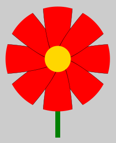
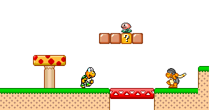

# \<canvas\> - Fonctions de dessin avancées Exercices

## Exercice 1 Courbes

Dans un canvas transparent de 960x600 pixels, tracez au milieu une ligne grise de 2px de largeur sur toute la hauteur.

Ajoutez une classe `exercice-1` à un canvas et complétez le dessin en utilisant la droite grise comme axe de symétrie et en inversant les couleurs.  
Vous devez utiliser au moins une fois chacune des méthodes `arc`, `arcTo`, `quadraticCurveTo` et `bezierCurveTo`.

## Exercice 2 Avec des fleurs

Dans un canvas transparent de 960x960 pixels, dessinez une galerie de 9 fleurs de couleurs différentes.

  <figure>
    
    <figcaption>Exemple de fleur</figcaption>
  </figure>

Chaque fleur doit être composée :

* D'une tige verte
* D'un pistil doré
* De huits pétales elliptiques répartis de façon continue autour du pistil, tronqués à leur extrémité extérieure

## Exercice 3 Tuiles

Dans un canvas de 320x160 pixels, reproduisez la scène ci-dessous en utilisant les images disponibles dans le répertoire `2 - Exercices/assets/images/tiles/`.

Modifiez votre script pour faire en sorte que la même scène puisse être affichée avec un zoom aléatoire compris entre 1 et 3.
