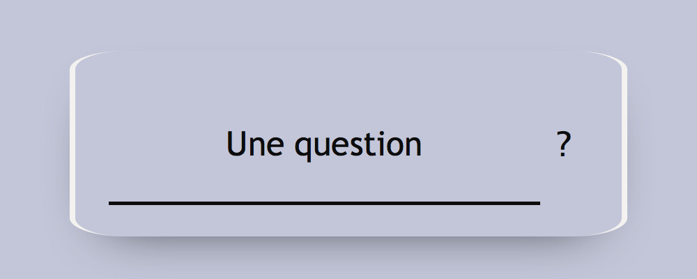

# Approfondissement HTML-CSS Examen pratique

## Exercice 1 Sémantique

_5 points_

Pour chacune des balises suivantes, définissez leur rôle dans la structuration d'un contenu HTML. Vous préciserez le cas échéant le ou les attributs obligatoires (ou fortement recommandés) de ces balises et leur contenu attendu.

* `abbr`
* `b`
* `label`
* `h7`
* `ol`

## Exercice 2 Définitions

_5 points_

Définissez les termes suivants :

* Reset CSS
* WCAG
* Fonction d'interpolation

## Exercice 3 Intégration

_10 points_

Pour cet exercice, vous vous baserez sur le fichier `exercice-3-enonce.html` fourni.

Vous ne devez modifier ni le code HTML ni le JavaScript ni les styles CSS présents dans ce fichier.
Pour chaque question, vous ajouterez en bas du bloc `<style>` un commentaire `/* Question X */` avant d'ajouter votre code.

Vous veillerez à convenablement indenter votre code.

### Question 1

Utilisez la propriété `float` pour placer les éléments `.form-field` et `.form-action` côte à côte.
Vous ferez en sorte que `.form-field` occupe les 9/10ème de l'espace disponible et `.form-action` le 1/10ème restant.

### Question 2

Positionnez le champ de recherche et son étiquette de sorte à ce qu'ils se superposent.
Sans modifier les couleurs de fond, vous ferrez en sorte que l'étiquette reste visible malgré ce positionnement.

### Question 3

Ajoutez une bordure au formulaire.
Vous devez obtenir le résultat visible sur la figure 1.

<figure>
  <figcaption>Figure 1</figcaption>
  
</figure>

La couleur de la bordure est `#f3f2f0` et son épaisseur est de 8px.

### Question 4

Ajoutez une ombre au formulaire.
Vous devez obtenir le résultat visible sur la figure 2.

<figure>
  <figcaption>Figure 2</figcaption>
  
</figure>

L'ombre est de couleur `#0c0c0c`. Elle est décalée du formulaire de 30px vers le bas et s'atténue sur une distance de 80px.

### Question 5

Au chargement de la page, le formulaire porte une classe `close`.
Au clic sur l'étiquette du champ de recherche, il perd cette classe et prend une classe `open`.
Quand l'utilisateur quitte le champ de recherche, la situation initiale est restaurée.

Utilisez les propriétés `opacity` et `z-index` pour faire en que :

* Lorsque le formulaire porte la classe `close`, l'étiquette du champ de recherche soit visible et cliquable mais pas le champ de recherche.
* Lorsque le formulaire porte la classe `open`, le champ de recherche soit visible et cliquable mais pas son étiquette

### Question 6

Ajoutez une transition sur le champ de recherche et son étiquette pour que le passage entre les états `open` et `close` du formulaire se fasse en douceur.

La transition devra démarrer immédiatement et durer 7/10ème de seconde. Vous utiliserez la fonction d'interpolation `ease-in-out`.
