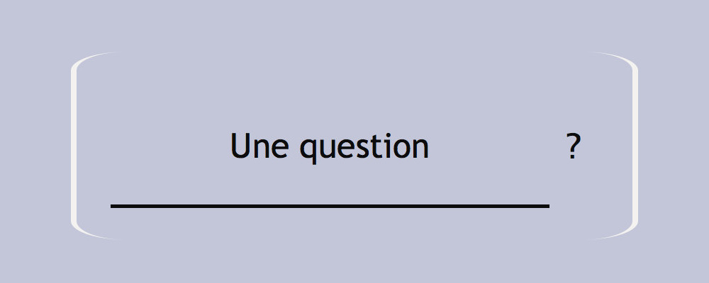
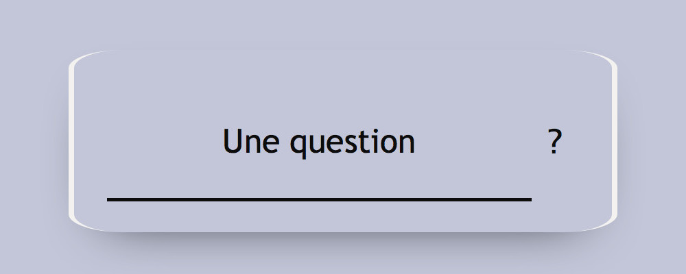

# Approfondissement HTML-CSS Examen pratique Correction

## Exercice 1 Sémantique

_5 points_

* `abbr`  
  Signale une abbréviation, un sigle ou un acronym dans un contenu.  
  L'attribut `title` doit contenir la version complète de l'abbréviation ou du sigle.
* `b`  
  Met en évidence une portion d'un contenu sans lui ajouter de signification particulière.
* `label`  
  Etiquette un champ de formulaire.  
  L'attribut `for` doit contenir l'identifiant (`id`) du champ étiqueté.
* `h7`  
  Cette balise n'existe pas. Le HTML ne prévoit que 6 niveaux de titres.
* `ol`  
  Introduit une liste ordonnée.

**Notation :**

* 1 point par balise convenablement défini.
* 0.5 point bonus pour chacun des attributs `title` et `for`.
* 0.5 point bonus pour chacun des attributs `title` et `for` si le contenu attendu est le bon.

## Exercice 2 Définitions

_5 points_

* **Reset CSS**  
  Ensemble de déclarations permettant de réinitialiser (ou d'uniformiser) les styles appliqués par défaut aux balises HTML par les navigateurs. Un reset CSS (ou une normalisation CSS) permet à un intégrateur de démarrer sur une base saine. Il doit être placé en tête de la feuille de styles.
* **WCAG**  
  Les "Web Content Accessibility Guidelines" sont les recommandations d'accessibilité pour les contenus web, éditées par la Web Accessibility Initiative (organe du W3C). Elles sont reconnues comme un standard international (ISO/IEC 40500).
* **Fonction d'interpolation**  
  Fonction mathématique permettant le calcul de l'évolution d'une valeur entre deux bornes connues. Elles sont notamment utilisées en animation pour donner aux mouvements une apparence plus naturelle.

**Notation :**

* 2 point par définition convenablement esquissée.

## Exercice 3 Intégration

_10 points_

Pour cet exercice, vous vous baserez sur le fichier `index.html` fourni.

Vous ne devez modifier ni le code HTML ni le JavaScript ni les styles CSS présents dans ce fichier.
Pour chaque question, vous ajouterez en bas du bloc `<style>` un commentaire `/* Question X */` avant d'ajouter votre code.

Vous veillerez à convenablement indenter votre code.

### Question 1

Utilisez la propriété `float` pour placer les éléments `.form-field` et `.form-action` côte à côte.
Vous ferez en sorte que `.form-field` occupe les 9/10ème de l'espace disponible et `.form-action` le 1/10ème restant.

**Correction**

    /* Question 1 */
    form:after {
      content: " ";
      display: table;
      clear: both;
    }
    
    .form-field {
      float: left;
      width: 90%;
    }

    .form-action {
      float: right;
      width: 10%;
    }

### Question 2

Positionnez le champ de recherche et son étiquette de sorte à ce qu'ils se superposent.
Sans modifier les couleurs de fond, vous ferrez en sorte que l'étiquette reste visible malgré ce positionnement.

**Correction**

    /* Question 2 */
    .form-field {
      position: relative;
    }

    label,
    input[type=search] {
      position: absolute;
    }
    
    label {
      z-index: 2;
    }
    
    input[type=search] {
      z-index: 1;
    }

### Question 3

Ajoutez une bordure au formulaire.
Vous devez obtenir le résultat visible sur la figure 1.

<figure>
  <figcaption>Figure 1</figcaption>
  
</figure>

La couleur de la bordure est `#f3f2f0` et son épaisseur est de 8px.

**Correction**

    /* Question 3 */
    form {
      border-style: solid;
      border-color: #f3f2f0;
      border-radius: 10%;
      border-width: 0 8px;
    }

### Question 4

Ajoutez une ombre au formulaire.
Vous devez obtenir le résultat visible sur la figure 2.

<figure>
  <figcaption>Figure 2</figcaption>
  
</figure>

L'ombre est de couleur `#0c0c0c`. Elle est décalée du formulaire de 30px vers le bas et s'atténue sur une distance de 80px.

**Correction**

    /* Question 4 */
    form {
      box-shadow: 0 30px 80px -55px #0c0c0c;
    }

### Question 5

Au chargement de la page, le formulaire porte une classe `close`.
Au clic sur l'étiquette du champ de recherche, il perd cette classe et prend une classe `open`.
Quand l'utilisateur quitte le champ de recherche, la situation initiale est restaurée.

Utilisez les propriétés `opacity` et `z-index` pour faire en que :

* Lorsque le formulaire porte la classe `close`, l'étiquette du champ de recherche soit visible et cliquable mais pas le champ de recherche.
* Lorsque le formulaire porte la classe `open`, le champ de recherche soit visible et cliquable mais pas son étiquette

**Correction**

    /* Question 5 */
    .close label {
      opacity: 1;
      z-index: 2;
    }
    .close input[type=search] {
      opacity: 0;
      z-index: 1;
    }
    
    .open label {
      opacity: 0;
      z-index: 1;
    }
    .open input[type=search] {
      opacity: 1;
      z-index: 2;
    }

### Question 6

Ajoutez une transition sur le champ de recherche et son étiquette pour que le passage entre les états `open` et `close` du formulaire se fasse en douceur.

La transition devra démarrer immédiatement et durer 7/10ème de seconde. Vous utiliserez la fonction d'interpolation `ease-in-out`.

**Correction**

    /* Question 6 */
    label,
    input[type=search] {
      transition-property: opacity, z-index;
      transition-timing-function: ease-in-out;
      transition-duration: 0.7s;
      transition-delay: 0s;
    }

**Notation :**

* 2 points par question, du moment que l'effet demandé est obtenu en un minimum de code.
* -2 points pour un code mal indenté
* -2 points si le HTML, le JavaScript ou les styles de base ont été modifiés.
