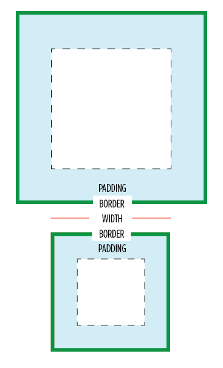

# Séance 2 - Nouveautés CSS3

## Sommaire

* Modèles de boite
* Webfonts
* Ombrages
* Transitions
* Animations
* Transformations
* Media queries

## Modèles de boite

Le modèle de boites utilisé pour calculer les dimensions d'un bloc peut désormais être sélectionné parmi plusieurs alternatives grâce à la propriété `box-sizing`.

<figure style="float: right">
  <figcaption>content-box vs border-box</figcaption>
  
</figure>

### content-box

Il s'agit de la valeur par défaut et historiquement la seule valeur supportée par les navigateurs. Les dimensions d'une boite sont calculées sans tenir compte de son espacement intérieur (`padding`) et de ses bordures.

### padding-box

Les dimensions d'une boite sont calculées en tenant compte de son espacement intérieur (`padding`) mais pas de ses bordures. Cette valeur a été ajouté récemment à la spécification et n'est pas encore convenablement supportée par tous les navigateurs.

### border-box

Les dimensions d'une boite sont calculées en tenant compte de son espacement intérieur (`padding`) et de ses bordures.

**Exercice 1 :** Modèles de boites

## Webfonts

### `@font-face`

Après avoir été retirée au passage de CSS2 à CSS2.1, la déclaration `@font-face` a fait son retour en CSS3. Si les designers devaient auparavant se contenter d'une poignée de polices dites "web safe" [^web-safe-fonts], il est désormais possible d'utiliser des polices personnalisées dans les pages web.

Leur utilisation est cependant compliquée par des incompatibilités d'implémentation entre les navigateurs (et quelques bugs). Selon la plage de navigateurs supportés, elles doivent être fournies :

* Au format SVG pour Safari iOS <= 4.1
* Au format EOT pour Internet Explorer <= 8.0
* Au format OpenType ou TrueType pour le navigateur Android <= 4.3, Safari iOS <= 4.3, Safari OS X <= 5.1
* Au format WOFF pour les navigateurs les plus récents

Une police étant rarement fournie dans chacun de ces formats, elle devra être convertie avant d'être utilisée [^webfont-converter]. 

Actuellement, la méthode recommandée pour déclarer une police web [^bulletproof-webfont] est la suivante :

    /*
      Version commentée
    */
    @font-face {
    
      /* Nom de la police
         Tel qu'il sera utilisé ensuite dans les déclarations `font` / `font-family` */
      font-family: "Open Sans";
      
       /* Internet Explorer 9 ne comprend pas la déclaration complète
          lorsqu'utilisé avec le mode de compatibilité */
      src: url("/fonts/opensans.eot");
      
      src: 
           /* Version EOT pour Internet Explorer <= 8
              Le "?" permet de contourner un bug du parser CSS.
              
              Le vrai nom du format des polices EOT est "embedded-opentype" mais
              préciser un mauvais format force IE 9+ à utiliser le format WOFF */
           url("/fonts/opensans.eot?#iefix") format("eot"),
           
           /* Version WOFF pour les navigateurs récents */
           url("/fonts/opensans.woff") format("woff"),
           
           /* Version TrueType pour les navigateurs ne supportant pas le format WOFF */
           url("/fonts/opensans.ttf") format("truetype"),
           
           /* Version SVG pour navigateurs mobiles anciens
              L'ancre est obligatoire pour indiquer à Safari iOS où trouver
              la déclaration de la police à l'intérieur du fichier SVG. */
           url("/fonts/opensans.svg#open_sans") format("svg")
                      
           ;
      
      /* Précision de la variante de la police (pour compatibilité avec Webkit) */
      font-weight: normal;
      font-style: normal;
      font-variant: normal;
    }
    
    /* Version courte */
    @font-face {
      font-family: "Open Sans";
      src: url("/fonts/opensans.eot");
      src: url("/fonts/opensans.eot?#iefix") format("eot"),
           url("/fonts/opensans.woff") format("woff"),
           url("/fonts/opensans.ttf") format("truetype"),
           url("/fonts/opensans.svg#open_sans") format("svg");
      font-weight: normal;
      font-style: normal;
      font-variant: normal;
    }

### Licences

Comme pour les images, assurez-vous de toujours disposer des droits nécessaires avant d'utiliser une police sur le web.

### Alternatives

S'assurer du meilleur chargement possible d'une police personnalisée n'exclu pas de porter attention aux alternatives proposées. Elles seront utiles lorsque le navigateur ne supporte pas `@font-face`, lorsque le fichier est indisponible ou durant son téléchargement, lorsque la police choisie ne supporte pas certains caractères, …

De nombreux articles et outils sont disponibles sur Internet pour sélectionner les alternatives les plus adaptées.  
Exemples :

* [CSS Font stacks](http://cssfontstack.com/) pour un certain nombre de polices couramment utilisées
* [Font stack builder](http://www.erin-lawrence.com/webfonts/) intègre des statistiques sur la disponibilité des polices

**Exercice 2 :** Webfonts

## Ombrage

La spécification CSS3 prévoit d'appliquer des ombres aux blocs et aux textes d'un document HTML. Si le support est parfois encore récent, les propriétés `box-shadow` et `text-shadow` se dégradent gracieusement sans effort.

### text-shadow

    text-shadow: (horizontal-offset vertical-offset (blur radius)? color?)*;

L'ombre d'un texte est définie par :

* Un décalage horizontal (vers la droite)
* Un décalage vertical (vers le bas)
* Un rayon de flou (optionnel)
* Une couleur (optionnelle)

Le rayon de flou détermine la distance en pixels sur laquelle la couleur de l'ombre s'estompera avant de devenir totalement transparente. Un rayon de flou de 0px correspond à une bordure nette de l'ombre.

### box-shadow

    box-shadow: (horizontal-offset vertical-offset (blur radius (spread distance))? color? inset?)*;

L'ombre d'une boite est définie par les mêmes propriétés que l'ombre d'un texte, auxquelles s'ajoutent :

* Une distance de propagation (optionnelle), précisant l'écart à appliquer aux dimensions de la boite pour calculer celles de l'ombre
* Le mot-clé `inset` s'il s'agit d'une ombre intérieure

Dans les deux cas, il est possible d'appliquer plusieurs ombres simultannement en les déclarant séparées par des virgules.

**Exercice 3 :** Ombrages

## Transitions

Les transitions CSS permettent de définir comment doivent évoluer les propriétés d'un élément lorsque celui-ci change d'état, suite à un événement natif (survol, focus, …) ou à une modification appliquée *via* JavaScript.

### Définir une transition

Une transition se défini à travers plusieurs propriétés :

* `transition-property`, qui attend comme valeur le nom de la propriété CSS qui devra évoluer au cours de la transition. Les mots-clés `all` et `none` sont acceptés pour indiquer respectivement toutes les propriétés ou aucune.
* `transition-duration`, qui attend comme valeur une durée correspondant au temps nécessaire à la réalisation de la transition.
* `transition-delay`, qui attend comme valeur une durée correspondant au temps d'attente avant le début de la transition.
* `transition-timing-function`, qui attend comme valeur le nom de la fonction qui devra être utilisée pour calculer l'évolution des valeurs de la propriété animée au cours de la transition.

Ces quatres propriétés peuvent également être utilisées avec des valeurs multiples, séparées par des virgules. L'animation se fera dans ce cas en appliquant à chaque propriété listée pour `transition-property` la durée, le delai et la fonction d'animation présente au même indice dans les listes passées à `transition-duration`, `transition-delay` et `transition-timing-function`.

    h1 {
      font-size: 16px;
      line-height: 1.5;
      text-indent: 0;
    }
    
    h1.heavy {
      font-size: 22px;
      line-height: 2;
      text-indent: 20px;
      
      /*
        Lorsqu'un élément `h1` recevra la classe .heavy, il sera animé comme suit :
        
        - Après un delai de 0s, la taille de la police passera en 1s de 16px à 22px
        - Après un délai de 0.5s, la hauteur de ligne passera en 0.5s de 1.5 à 2
        - Après un délai de 1.5s, l'indentation du texte passera en 2s de 0 à 20px
        
        L'animation complète sera étalée sur 3.5s.
      */
      transition-property: font-size, line-height, text-indent;
      transition-duration: 1s, 0.5s, 2s;
      transition-delay: 0s, 0.5s, 1.5s;
    }

Un raccourci `transition` est disponible pour définir une animation en une fois. Comme les autres, cette propriété accepte les valeurs multiples.

    h1.heavy {
      […]
      /* Équivalent utilisant la notation raccourcie */
      transition: font-size 1s 0s,
                    line-height 0.5s 0.5s,
                    text-indent 2s 1.5s;
    }

Pour chaque transition définie de cette façon, les paramètres autres que le nom de la propriété animée sont tous facultatifs. Leur ordre importe peu mais la première durée rencontrée sera toujours considérée comme correspondant à `transition-duration`.

### Fonctions d'interpolation

L'évolution de la valeur d'une propriété au cours d'une transition n'est pas obligatoirement linéaire. Dans la plupart des cas, l'effet produit ne serait d'ailleurs pas naturel ou approprié. Pour répondre à ce problème, les outils d'animation empruntent aux mathématiques des fonctions d'interpolations [^easing-functions].

La spécification CSS prévoit 2 fonctions d'interpolation paramétrables :

* `steps(<n>, <(start|end)>)` pour des progressions par palier
* `cubic-bezier(<f>, <f>, <f>, <f>)` pour des progressions continue suivant une courbe de Bézier

Ces deux fonctions sont détaillées et illustrées dans [la spécification de la propriété `transition-timing-function`](http://www.w3.org/TR/css3-transitions/#transition-timing-function-property), qui supporte également 7 raccourcis pour les usages les plus fréquents :

* `ease`, équivalente à `cubic-bezier(0.25, 0.1, 0.25, 1)`
* `linear`, équivalente à `cubic-bezier(0, 0, 1, 1)`
* `ease-in`, équivalente à `cubic-bezier(0.42, 0, 1, 1)`
* `ease-out`, équivalente à `cubic-bezier(0, 0, 0.58, 1)`
* `ease-in-out`, équivalente à `cubic-bezier(0.42, 0, 0.58, 1)`
* `step-start`, équivalent à `steps(1, start)`
* `step-end`, équivalent à `steps(1, end)`

<figure>
  
  <figcaption>
    Courbes de Bézier par défaut disponibles en CSS 
    Source : <http://letrainde13h37.fr/17/transitions-et-animations-css/>
  </figcaption>
</figure>

**Exercice 4 :** Transitions

## Animations

Une animation CSS se défini comme une succession de transitions *via* la propriété `@keyframes`.

    @keyframes zorro {
      from {
        top: 0;
        left: 0;
      }

      33% {
        top: 0;
        left: 100%;
      }
    
      66% {
        top: 100%;
        left: 0;
      }
    
      to {
        top: 100%;
        left: 100%;
      }
    }

L'animation peut ensuite être appliquée à un élément *via* la propriété `animation-name` :

    h1 {
      animation-name: zorro;
    }

Il est également possible de contrôler le comportement de l'animation pour chaque élément sur laquelle elle est appliquée *via* les propriétés :

* `animation-duration`, qui attend comme valeur une durée correspondant au temps nécessaire à la réalisation de l'animation.
* `animation-delay`, qui attend comme valeur une durée correspondant au temps d'attente avant le début de l'animation.
* `animation-timing-function`, qui attend comme valeur le nom de la fonction qui devra être utilisée pour calculer l'évolution des valeurs animées entre deux étapes. Les fonctions supportées sont les mêmes que pour les transitions.
* `animation-iteration-count`, qui attend comme valeur un entier correspondant au nombre de fois où l'animation devra être répétée. Le mot-clé `infinite` est supporté pour les animations qui doivent être répétées indéfiniment.
* `animation-play-state`, qui accepte deux valeurs, `running` ou `paused` 
* `animation-direction`, qui contrôle la façon dont sera jouée l'animation pour un élément et accepte les valeurs :
  - `normal`, pour jouer l'animation de la première à la dernière étape
  - `reverse`, pour jouer l'animation de la dernière à la première étape
  - `alternate`, pour inverser le sens de l'animation à chaque itération
  - `alternate-reverse`, pour inverser le sens de l'animation à chaque itération, en démarrant par la dernière étape
* `animation-fill-mode`, qui contrôle les propriétés appliquées à l'élément animé en dehors de l'animation et accepte les valeurs :
  - `none`, pour ne pas altérer les règles appliquées en dehors de l'animation
  - `backwards`, pour appliquer les règles de départ de la première étape jouée durant le `animation-delay`
  - `forwards`, pour que les règles de la dernière étape jouée restent appliquées après la fin de l'animation
  - `both`, qui combine `backwards` et `forwards`

Comme pour les transitions, ces 7 propriétés peuvent également être utilisées avec des listes de valeurs, pour appliquer plusieurs animations à un élément.

Un raccourci `animation` est disponible pour définir une animation en une fois. Comme les autres, cette propriété accepte les valeurs multiples.

    h1 {
      […]
      animation: zorro 3s ease 2s infinite alternate both running;
    }

Pour chaque animation définie de cette façon, les paramètres autres que le nom de l'animation appliquée sont tous facultatifs. Leur ordre importe peu mais la première durée rencontrée sera toujours considérée comme correspondant à `animation-duration`.

**Exercice 5 :** Animations

## Design adaptatif

### `@viewport`

Si on oublie quelques tentatives plus ou moins réussies comme le WAP, le web n'est apparu sur mobile que très récemment et alors qu'il existait déjà des milliers de sites, tous construits pour s'afficher sur un écran d'ordinateur.

Pour afficher ces sites sur des écrans de petites tailles sans briser leur mise en page, les navigateurs mobiles ont fait le choix d'utiliser par défaut une fenêtre virtuelle de dimensions bien supérieures à celle de l'écran et de laisser l'utilisateur zoomer sur les parties qu'il souhaite consulter.

Ce comportement n'est cependant pas le plus adapté dans le cas d'un site prévu pour être consulté sur des mobiles. Prises en compte uniquement par les navigateurs mobiles, les règles `@viewport` permettent de contrôler les dimensions de la fenêtre virtuelle du navigateur.

> **Note**
> 
> Les règles `@viewport` sont encore en cours de spécification et ne sont pas supportées par la plupart des navigateurs qui implémentent pour le moment un équivalent sous la forme de la balise `<meta name="viewport" />`.
>
> La syntaxe diffère entre les règles `@viewport` et la balise `<meta name="viewport" />` mais cette dernière étant la seule utilisable à l'heure actuelle, cette section se concentrera sur leur écriture.

Le contenu de la balise `<meta name="viewport" />` peut accueillir plusieurs propriétés, séparées par des virgules :

* `width` pour fixer la largeur du viewport, en pixel ou *via* le mot-clé `device-width`
* `height` pour fixer la hauteur du viewport, en pixel ou *via* le mot-clé `device-height`
* `initial-scale` pour fixer le niveau de zoom au chargement de la page
* `maximum-scale` et `minimum-scale` pour fixer les limites du zoom acceptées
* `user-scalable` pour indiquer si l'utilisateur peut ou non zoomer dans la page

Étant donnés la très grande variété des tailles et des résolutions d'écrans mobiles[^screensizes] et le fait que les navigateurs mobiles mentent régulièrement sur leurs capacités[^les-mobiles-mentent], la balise `<meta name="viewport" />` est courament écrite sous cette forme :

    <meta name="viewport" content="width=device-width,initial-scale=1" />

* `width=device-width` défini la largeur du viewport à celle de l'appareil. La page utilisera tout l'espace disponible quelque soient les dimensions de l'écran.
* `initial-scale=1` rétabli le niveau de zoomau chargement de la page à 1.
* `user-scalable=no` indique qu'il n'est pas possible à l'utilisateur de zoomer. `maximum-scale=1` est utilisé en complément, pour les navigateurs ne supportant pas `user-scalable`.

### `@media`

Les règles `@media` sont apparues en CSS2 et permettent de cibler les supports auxquels doivent s'appliquer les styles qu'elles contiennent. Elles ont depuis longtemps été utilisées *via* l'attribut `media` de la balise `link` pour déclarer les feuilles de styles spécifiques à l'impression par exemple.

    <link rel="stylesheet" type="text/css" href="/assets/stylesshets/style.css" />
    <link rel="stylesheet" type="text/css" href="/assets/stylesshets/print.css" media="print" />

Là où CSS2 ne supporte que des conditions sur le type de media dans une règle `@media`, CSS3 permet de distinguer plus finement les appareils en enrichissant les critères disponibles avec notamment :

* `width`, `height` et `aspect-ratio` qui indiquent respectivement la largeur, la hauteur et les proportions de la fenêtre.
* `device-width`, `device-height` et `device-aspect-ratio` qui indiquent respectivement la largeur, la hauteur et les proportions de l'écran
* `orientation`
* `resolution`

À l'exception de `orientation` pour lequel cela n'aurait pas de sens, tous ces critères peuvent être préfixés de `min-` ou `max-` pour écrire les conditions d'une requête media.

    @media screen and (min-device-width: 960px) and (max-resolution: 124dpi) {
      /* Les styles décrits à l'intérieur de cette règle @media ne seront appliqués :
       * 
       * - que sur écrans
       * - uniquement si la largeur de l'écran est supérieure ou égale à 960px
       * - uniquement si la résolution de l'écran est inférieure ou égale à 124dpi
       */
    }

La spécification définie également d'autres critères pour cibler les périphériques en fonction de leur capacité à rendre les couleurs (`color`, `color-index` et `monochrome`) ou de leur méthode d'affichage (`scan` pour les téléviseurs, `grid` pour les affichage à chasse fixe).

**Exercice 6 :** Design adaptatif

[^web-safe-fonts]: [Safe web fonts](http://web.mit.edu/jmorzins/www/fonts.html)
[^webfont-converter]: [Webfont generator by FontSquirrel](http://www.fontsquirrel.com/tools/webfont-generator)
[^bulletproof-webfont]: [Further Hardening of the Bulletproof Syntax](http://www.fontspring.com/blog/further-hardening-of-the-bulletproof-syntax)
[^easing-functions]: [Fonctions d'interpolation fréquentes](http://easings.net/fr)
[^screensizes]: <http://screensiz.es/>
[^les-mobiles-mentent]: [Les mobiles nous mentent !](http://blog.goetter.fr/articles/les-mobiles-nous-mentent/), par Raphaël Goetter