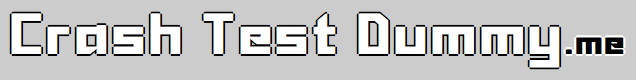
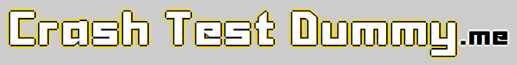
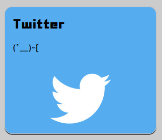

# Séance 2 - Nouveautés CSS3 Exercices

## Exercice 1 Modèles de boite

Modifiez la classe .column pour utiliser le modèle de boite `border-box`.  

## Exercice 2 Webfonts

Modifiez les styles des titres `h1` et `h2` pour utiliser la police "Sanidana".

## Exercice 3 Ombrages

### text-shadow

Ajoutez une ombre noire sur le texte du titre `h1`.  
Les couleurs de l'ombre et du texte doivent s'inverser à l'intérieur de la balise small.

<figure style="float: right">
  
</figure>

Que se passe-t-il si vous ne précisez pas de couleurs ?
Que se passe-t-il si vous indiquez un décalagage horizontal négatif ?
Que se passe-t-il si vous indiquez un décalagage vertical négatif ?
Que se passe-t-il si vous indiquez un rayon de flou négatif ?
Comment obtenir une ombre qui englobe l'ensemble du texte ?

Ajoutez une seconde ombre jaune (#f6dd00) sur le texte du titre `h1`.

<figure style="float: right">
  
</figure>

### box-shadow

Ajoutez une ombre au survol sous les liens vers Twitter, Github et DevianART.

<figure style="float: right">
  
</figure>

Que se passe-t-il si vous indiquez un rayon de flou différent de 0 ?
Que se passe-t-il si vous indiquez une distance de propagation différente de 0 ?

## Exercice 4 Transitions

Modifiez les styles appliqués aux liens vers Twitter, Github et DeviantART pour ajouter au survol une transition telle que :

* L'ombre apparaisse en premier, sur 0.5s avec une progression linéaire
* La hauteur de la boite et la couleur de fond évoluent ensuite, sur 1s, avec une progression amortie au début et à la fin
* L'image de fond apparaisse en dernier, remontant du bas de la boite, sur 0.5s, avec une progression par palier

Définissez ensuite l'animation inverse à utiliser lorsque la souris quitte le lien. Décrire et expliquer le comportement observé.

Modifiez la transition pour augmenter la graisse du texte contenu dans les paragraphes. Décrire et expliquer le comportement observé.

## Exercice 5 Animations

Ajoutez une animation sur la balise `h1 small` pour faire varier son ombre et donner l'impression qu'elle est éclairée par intermittence.

Vous essaierez de rendre cette animation la plus fluide possible.

## Exercice 6 Design adaptatif

Modifiez les styles appliqués à la page pour qu'elle puisse s'afficher sur un navigateur mobile.

* La taille du titre doit être réduite pour qu'il puisse rester lisible sans retour à la ligne.
* Le visuel doit passer sous le titre
* Les liens vers Twitter, Github et DeviantART doivent s'afficher l'un en dessous de l'autre

Pour ne pas compliquer le code outre mesure, on considérera qu'il n'existe qu'un seul point de rupture, lorsque la largeur de l'écran devient inférieure à 960px.