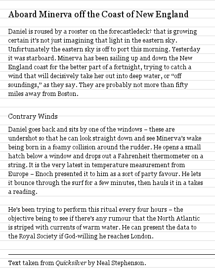
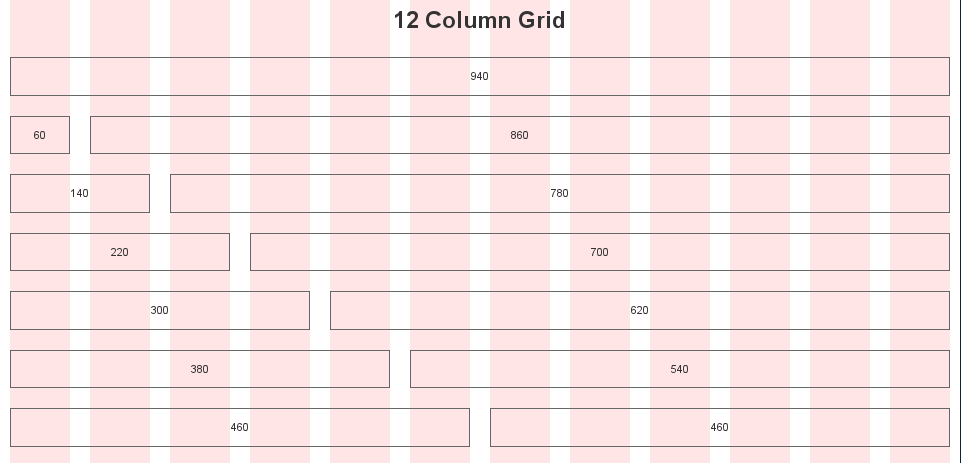

# Séance 3 - Outils de développement front

## Sommaire

* Harmonisation des styles entre navigateurs
* Frameworks CSS : Blueprint, Bootstrap, Foundation
* Pré-processeurs : Less, Sass
* Post-processeurs
* Outils d'automatisation : Grunt / Gulp

## Harmonisation des styles entre navigateurs

Si la spécification HTML5 précise pour certaines balises les styles qui doivent leur être appliqués par défaut, ces indications n'existaient pas dans les versions précédentes. Pour afficher les documents HTML, chaque navigateur a dû faire le choix d'une mise en forme par défaut.

*Exemples :*

* IE10 signale l'état actif d'un lien par une couleur de fond grise
* Firefox 4+, Safari et Chrome applique une graisse plus prononcée aux éléments `<b>` et `<strong>`
* Chaque navigateur ou presque a sa propre définition de la taille de police à appliquer à un `<small>`

Pour simplifier l'intégration d'un site internet, il est indispensable d'harmoniser ces styles.

La technique du `reset` consiste à remettre à 0 un certains nombre de valeurs. Sous sa forme la plus simple, elle s'écrit en quelques lignes :

	* {
	  margin: 0;
	  padding: 0;
	}

En plus d'être très gourmande en ressource à cause de l'utilisation du sélecteur universel `*`, cette technique est incomplète (elle ne corrige pas les différences de valeur de la propriété `display` par exemple) et supprime des styles que l'on peut souhaiter conserver (styles des formulaires, état :focus ou :active des liens…).  

Des resets plus évolués existent aujourd'hui, qui gomment en partie ces défauts :

* [Le reset CSS d'Eric Meyer](http://meyerweb.com/eric/tools/css/reset/), sans doute le plus connu.
* [normalize.css](http://necolas.github.io/normalize.css/), qui se concentre sur l'harmonisation des styles plutôt que sur leur suppression systématique.

L'objectif est à chaque fois le même : fournir à l'intégrateur une ardoise vierge pour démarrer.

## Frameworks CSS

Les frameworks CSS vont plus loin que les resets, qu'ils utilisent quasi-systématiquement comme base. En s'appuyant sur un ensemble de bonnes pratiques, ils fournissent des classes utilisables par les intégrateurs pour construire leurs pages plus rapidement.

Avec plus ou moins de succès, ils fournissent à l'intégrateur les outils pour rythmer les pages[^rythm] :

* Verticalement, en établissant une base typographique[^vertical-rythm]
* Horizontalement, en construisant suivant une grille[^css-grid]

Ils incluent généralement des styles de formulaires, éléments omniprésents sur le web et particulièrement difficile à intégrer de façon pertinente.

<figure>
  
  <figcaption>
    Ryhtme vertical 
    Source: <a href="http://24ways.org/2006/compose-to-a-vertical-rhythm/">24ways.org</a>
  </figcaption>
</figure>

<figure>
  
  <figcaption>
    Exemple de grille sur 12 colonnes 
    Source: <a href="http://960.gs/">960.gs</a>
  </figcaption>
</figure>

Exemples "historiques" :

* [Blueprint CSS](http://www.blueprintcss.org/)  
  L'un des premiers frameworks CSS à avoir été largement utilisé, il n'est aujourd'hui plus maintenu.
* [960gs](http://960.gs/)  
  A connu un fort succès grâce à la flexibilité de ses grilles.
  Son successeur, [unsemantic](http://unsemantic.com/), propose une approche similaire pour des designs responsives.

Des frameworks plus modernes :

* [Bootstrap](http://getbootstrap.com/) (basé sur normalize.css)
* [Foundation](http://foundation.zurb.com/) (basé sur normalize.css)
* [KNACSS](http://www.knacss.com/) (basé sur un autre reset, plus minimaliste)

Les frameworks modernes vont au-delà de l'aide à l'intégration en fournissant des composants complets pour les pages web (menus déroulants, onglets, …) et s'accompagnent souvent de librairies JavaScript.
 
### Avantages

* Une bonne base pour démarrer une intégration
* Un ensemble de bonnes pratiques
* La compatibilité entre les navigateurs
* Un langage commun

### Inconvénients

* Des classes peu sémantiques (en opposition avec les micro-formats)
* Une structure HTML imposée
* Du code inutile
* Des styles par défaut parfois difficiles à oublier / pénibles à surdéfinir

## Pré-processeurs CSS

Les pré-processeurs CSS sont apparus récemment et tentent de résoudre plusieurs problèmes :

* Combler les "manques" du langage CSS  
  En y ajoutant variables, boucles, fonctions, …
* Simplifier la maintenance des projets  
  En autorisant la séparation des styles en fichiers plus petits sans pénaliser les performances

Ils fournissent pour cela une couche d'abstraction au dessus du langage CSS, sous la forme d'un nouveau langage qui devra être compilé.

* [Sass](http://sass-lang.com/)
* [Less](http://lesscss.org/)

Exemples d'utilisation :

* Générateur de grilles
* Réaliser des calculs et des conversions (dimensions, couleurs)
* Simplifier l'écriture des règles spécifiques aux mobiles (assets @2x)

Des outils supplémentaires, basés sur les pré-processeurs, sont venus s'ajouter à la palette d'outils des intégrateurs :

* Compass fournit une large collection de mixins pour Sass et ajoute la gestion des sprites
* Certains frameworks écrits intégralement pour un pré-processeur (ex: Foundation et Susy pour Sass, Bootstrap pour Less)

### Avantages

* Moins de répétitions dans le code
* Uniformisation (*via* les variables)
* Souplesse (variables, fonctions, boucles, …)
* Maintenance

### Inconvénients

* Langage supplémentaire
* Compilation nécessaire
* Vigilance à apporter sur l'utilisation de certaines fonctionnalités (sélecteurs imbriqués, héritages non désirés, …)

En résumé, il faut déjà bien connaitre CSS pour bien utiliser un pré-processeur.

## Post-processeurs CSS

A force d'ajouter des fonctionnalités aux pré-processeurs CSS, il est venu à certains l'idée de distinguer ce qui tient lieu de l'abstraction au dessus de CSS des traitements qui doivent être appliqués à une feuille de styles avant sa mise en ligne. Ainsi sont nés les post-processeurs CSS.

* [Rework](https://github.com/reworkcss/rework)
* [PostCSS](https://github.com/ai/postcss)

Quelques cas d'utilisation :

* [Autoprefixer](https://github.com/ai/autoprefixer) ajoute les préfixes vendeurs en se basant sur CanIUse
* [pixrem](https://github.com/robwierzbowski/node-pixrem) ajoute un fallback en pixels aux dimensions écrites en `rem`
* [Move Media](https://github.com/reworkcss/rework-move-media) regroupe les déclarations correspondant au même media
* Minification
* Concaténation
* Validation
* …

## Outils d'automatisation

* Grunt
* Gulp

[^rythm]: [La macrotypographie de la page web](http://www.paris-web.fr/2010/programme/macrotypographie-page-web.php), présentation de Anne-Sophie Fradier lors de ParisWeb 2010.
[^vertical-rythm]: [Compose a vertical rythm](http://24ways.org/2006/compose-to-a-vertical-rhythm/).
[^css-grid]: [Grids are good](assets/grids_are_good.pdf), présentation de Mark Boulton sur l'utilisation d'une grille pour le redesign de Yahoo.
[framework-css]: [Comparaison des frameworks CSS](http://usablica.github.io/front-end-frameworks/compare.html)
[^grid-system]: <http://www.thegridsystem.org/>