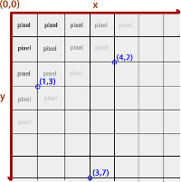
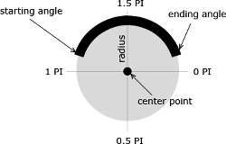
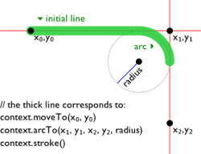
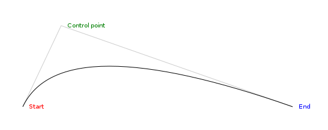
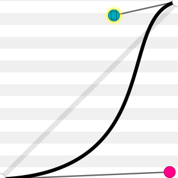
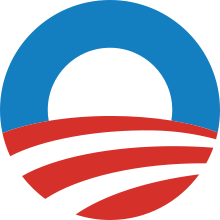
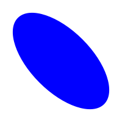

# Séance 6 - \<canvas\> 2D

**Date :** 12/02/2014 - 9h30 / 12h30 et 13h30 / 16h30

## Sommaire

* La balise \<canvas\>
* Le contexte bitmap
* Coordonnées 2D
* Dessiner dans un \<canvas\>
* Animer un \<canvas\>

## La balise \<canvas\>

La balise `<canvas>` est un élément apparu en HTML5 et aujourd'hui supporté par la grande majorité des navigateurs. Il fournit un surface de pixels sur laquelle il est possible de dessiner via une API JavaScript.

Par défaut, un `<canvas>` est un élément inline transparent mesurant 300x150 pixels.

    <canvas id="slate"></canvas>

La balise `<canvas>` accepte les attributs applicables à n'importe quelle balise HTML ainsi que `width` et `height`. Il est possible de définir un contenu alternatif pour les navigateurs ne supportant pas `<canvas>` de la même façon que pour un  `<object>`.

## Le contexte bitmap

La seule façon de modifier le contenu affiché par un `<canvas>` est d'utiliser l'API Javascript dédiée pour manipuler le contexte d'affichage bitmap qu'il représente.

La balise `<canvas>` est un élément du DOM, au même titre que n'importe quelle autre balise. Elle dispose cependant de quelques méthodes supplémentaires, permettant d'accéder au contexte bitmap qu'elle affiche :

* `getContext` : retourne un object représentant le contexte bitmap
* `toDataURL` : retourne le contenu affiché sérialisé sous forme d'une data-uri
* `toBlob` : retourne le contenu affiché sous forme d'un objet JavaScript de type Blob

Les fonctions de dessin sont accessibles depuis l'objet représentant le contexte bitmap. `<canvas>` supporte plusieurs types de contexte pour des modes de dessin différents.

    <canvas id="slate"></canvas>
    
    

Le contexte 2D est spécifié par le W3C [^2D-specification] et largement supporté. WebGL est une implémentation en JavaScript du standard OpenGL ES 2.0 spécifiée par Khronos Group [^webgl-specification] et n'est supportée que par les navigateurs les plus récents.  
Pour la suite du cours, nous ne nous intéresserons qu'au contexte 2D.

## Coordonnées 2D

<figure style="float: right">
  
  <figcaption>
    Coordonnées à l'intérieur d'un canvas 
    Source: <a href="http://www.alsacreations.com/tuto/lire/1484-introduction.html">alsacreations.com</a>
  </figcaption>
</figure>

Le point d'origine (0, 0) est situé dans le coin supérieur gauche.

L'axe des abscisses s'étire dans le sens de la largeur ; l'axe des ordonnées dans le sens de la hauteur.

À l'intérieur du canvas, les coordonnées sont exprimées en pixels.

## Dessiner dans un \<canvas\>

L'objet retourné par `getContext('2d')`[^CanvasRenderingContext2D] est littéralement le crayon avec lequel nous allons pouvoir dessiné sur l'espace de pixels contenu dans le canvas : en modifiant les valeurs des propriétés de l'objet, on influence l'effet produit par le prochain coup de crayon ; en appelant l'une des méthodes de l'objet, on donne ou prépare un coup de crayon.

### Choisir sa couleur

Deux propriétés du contexte permettent de contrôler la couleur appliquée :

* `strokeStyle` le style utilisé pour le tracé des lignes et des contours
* `fillStyle`, le style appliqué pour le remplissage des zones

C'est deux propriétés peuvent prendre comme valeur une chaine de caractère contenant une couleur CSS, un dégradé ou un motif.

A la création du canvas, la couleur définie pour ces deux propriétés est le noir.

### Tailler son crayon

L'épaisseur des lignes et des contours tracés peut être contrôlés en modifiant la valeur de l'attribut `lineWidth`. Par défaut, elle est définie à 1px.

Les propriétés `lineCap` et `lineJoin` contrôlent respectivement l'allure des lignes lorsqu'elles se terminent et lorsqu'elles s'enchainent.

### Un simple cadre

Parce qu'il s'agit d'une des formes géométriques les plus simples à décrire et sans doute parce que la balise `<canvas>` en est un elle-même, le rectangle bénéficie d'un traitement particulier dans l'API de dessin 2D et dispose de 3 méthodes dédiées :

* `fillRect` pour tracer un rectangle plein
* `strokeRect` pour tracer les contours d'un rectangle
* `clearRect` pour effacer une zone rectangulaire

Ces trois méthodes attendent les mêmes arguments :

    context.fillRect(x, y, width, height);
    // Où x et y sont les coordonnées du coin supérieur gauche

**Exercice 1 :** Drapeaux

Pour toutes les autres formes, il faudra passer par les méthodes de contructions de chemins.

### Le chemin le plus court

On dit souvent que le plus court chemin entre deux points est la ligne droite. C'est vrai également dans l'API de dessin 2D de `<canvas>` où il n'existe pas de méthode pour tracer des lignes. Pour tracer la diagonale de notre canvas par exemple, il sera donc nécessaire de construire le chemin décrivant cette diagonale avant d'en demander le tracé du contour.

    context.beginPath();                        // Démarre un nouveau chemin
    context.moveTo(0, context.canvas.height);   // Déplace le curseur en bas à gauche du canvas
    context.lineTo(context.canvas.width, 0);    // Ajoute au chemin une ligne reliant le point courant
                                                // au coin supérieur droit.
    
    context.stroke();                           // Trace le contour du chemin

**Exercice 2 :** Compositions

### Quelques détours

Les méthodes de constructions de chemins disponibles dans l'API de dessin 2D permettent de décrire des formes complexes avant d'en tracer les contours *- avec la méthode `stroke` -* ou de les remplir *- avec la méthode `fill` -*. À partir d'un nombre réduit de fonctions, il est possible de décrire toutes les formes géométriques, pas à pas.

Un triangle peut ainsi être décrit comme un chemin passant par trois points.

    // Démarre un nouveau chemin
    context.beginPath();
    
    // Déplace le curseur en bas à gauche du canvas
    context.moveTo(0, context.canvas.height);
    
    // Ajoute au chemin une ligne reliant le point courant
    // au point situé au milieu du bord supérieur
    context.lineTo(context.canvas.width / 2, 0);
    
    // Ajoute au chemin une ligne reliant le point courant
    // au point situé en bas à droite du canvas
    context.lineTo(context.canvas.width, context.canvas.height);
    
    // Ferme le chemin en reliant le point courant au point de départ
    context.closePath();
    
    // Trace le contour du chemin
    context.stroke();
    
    // Rempli l'espace délimité par le chemin
    // (Ceci est possible car notre chemin est clos)
    context.fill();

**Exercice 3 :** Polygones

### Virages serrés

Tous les chemins ne peuvent pas être décrits uniquement comme une succession de segments rectilignes, sous peine de nécessiter une infinité de segments pour décrire fidèlement un cercle. Heureusement, l'API de dessin 2D prévoit plusieurs méthodes pour tracer des courbes, régulières ou non.

La méthode `arc` permet d'ajouter un arc de cercle à un chemin.

    context.beginPath();
    context.arc(x, y, radius, startAngle, endAngle, counterClockwise);
    context.stroke();

  <figure>
    
    <figcaption>
      Les paramètres de la méthode `arc` 
      Source : <a href="http://www.html5canvastutorials.com/tutorials/html5-canvas-arcs/">html5canvastutorials.com</a>
    </figcaption>
  </figure>

Correspondance des arguments :

* `x`, l'abscisse du centre de l'arc de cercle
* `y`, l'ordonnée du centre de l'arc de cercle
* `radius`, le rayon de l'arc de cercle
* `startAngle`, l'angle de départ de l'arc de cercle, mesuré en radians par rapport à l'axe des abscisses
* `endAngle`, l'angle de fin de l'arc de cercle, mesuré en radians par rapport à l'axe des abscisses
* `counterClockwise`, un booléen indiquant si l'arc doit être tracé dans le sens anti-horaire ou non. Vaut `true par défaut`.

L'exemple ci-contre est obtenu en utilisant :

    context.beginPath();
    context.arc(
      context.canvas.width / 2,   // x
      context.canvas.height / 2,  // y
      75,                         // radius
      1.1 * Math.PI,              // startAngle
      1.9 * Math.PI,              // startAngle
      false                       // counterClockwise
      );
    context.stroke();

  <figure>
    
    <figcaption>
      Fonctionnement de la méthode `arcTo` 
      Source : <a href="https://developer.mozilla.org/en-US/docs/Web/API/CanvasRenderingContext2D#arcTo%28%29">developer.mozilla.org</a>
    </figcaption>
  </figure>

La méthode `arcTo` permet d'ajouter un arc de cercle à un chemin, en utilisant cette fois des points de contrôle pour guider la trajectoire.

    context.beginPath();
    context.arcTo(xc, yc, xa, ya, radius);
    // Avec (xc, yc) les coordonnées
    // du point de contrôle et (xa, ya)
    // les coordonnées du point d'arrivée.
    
    context.stroke();

L'arc de cercle calculé sera relié au point précédent ainsi qu'au point d'arrivée par des lignes droites. Cette méthode est utiles pour tracers des coins arrondis.

  <figure>
    
    <figcaption>
      Fonctionnement de la méthode `quadraticCurveTo` 
      Exemple interactif disponible sur <a href="http://www.rgraph.net/blog/2013/january/an-example-of-the-html5-canvas-quadraticcurveto-function.html">www.rgraph.net</a>
    </figcaption>
  </figure>

Sur le même principe, la méthode `quadraticCurveTo` ajoute un segment au chemin qui sera calculé de façon à être tangent à deux droites, la première partant du point courant vers le point de contrôle et la seconde partant du point de contrôle vers le point d'arrivée.

    context.beginPath();
    context.moveTo(x0, y0);
    context.quadraticCurve(xc, yc, xa, ya);
    // Avec (xc, yc) les coordonnées
    // du point de contrôle et (xa, ya)
    // les coordonnées du point d'arrivée.
    
    context.stroke();

  <figure>
    
    <figcaption>
      Fonctionnement de la méthode `bezierCurveTo` 
      Exemple interactif disponible sur <a href="http://cubic-bezier.com/">cubic-bezier.com</a>
    </figcaption>
  </figure>

Enfin, la méthode `bezierCurveTo` crée un nouveau segment de chemin qui suit une courbe de Bézier cubique.

    context.beginPath();
    context.moveTo(x0, y0);
    context.quadraticCurve(xc1, yc1, xc2, yc2, xa, ya);
    // Avec (xc1, yc1) les coordonnées du premier point de contrôle,
    // (xc2, yc2) les coordonnées du second point de contrôle
    // et (xa, ya) les coordonnées du point d'arrivée.
    
    context.stroke();

**Exercice 4 :** Courbes

### Sans dépasser

Avec la méthode `clip`, les chemins peuvent également servir à délimiter une zone du canvas à l'intérieur de laquelle on souhaitera pouvoir dessiner sans interférer avec les éléments déjà présents au dehors.

Ceci peut permettre de dessiner le reflet dan un miroir sans sortir de son cadre ou l'image sur une télévision sans sortir de l'écran. Dans certains cas, cela peut également permettre de tracer une forme complexe en la décomposant en une série de formes simples contraintes à l'intérieur d'un espace.

  <figure>
    
    <figcaption>
      Le logo de la campagne 
      de Barack Obama en 2008
    </figcaption>
  </figure>

    var slate   = document.getElementById('slate')
      , context = slate.getContext('2d')
      , x       = slate.width / 2
      , y       = slate.height / 2
      , radius  = 75
      , offset  = 15
      ;
      
    // Sauvegarde l'état du canvas
    // pour pouvoir le restaurer ensuite.
    context.save();
    
    // Crée un chemin décrivant un cercle au centre
    context.beginPath();
    context.arc(x, y, radius, 0, 2 * Math.PI, false);
    
    // Contraint toutes les opérations suivantes à
    // ne modifier que l'intérieur de ce chemin
    context.clip();

    // Remplie la zone de bleu
    context.fillStyle = 'blue';
    context.fillRect(x - radius, y - radius,
      2 * radius, 2 * radius);
    
    // Dessine le disque blanc
    context.beginPath();
    context.arc(x, y, radius * 2/3, 0, 2 * Math.PI, false);
    context.fillStyle = 'white';
    context.fill();
    
    // Dessine les 5 disques rouge et blanc
    for (var i = 0; i < 5; i++) {
      context.beginPath();
      context.arc(
        x + (i * offset * 1.4),
        y + radius * 3 + (i * offset * 0.8),
        radius * 3,
        0,
        2 * Math.PI,
        false
      );
      context.fillStyle = (i % 2 == 0 ? 'red' : 'white');
      context.fill();
    }

    // Rétabli l'état du canvas enregistré par `save`
    // Nous pouvons de nouveau dessiner partout.
    context.restore();

Les méthodes `save` et `restore` ne mémorisent ou rétablissent pas uniquement la zone de travail. Elles conservent toutes les autres propriétés du contexte (`fillStyle`, `lineWidth`, ...) à l'intérieur d'une pile.

D'autres opérations de composition, plus complexes, sont possibles en utilisant la propriété `globalCompositeOperation`[^globalCompositionOperation] mais celles-ci ne sont pas encore totalement supportées.

### Tordre l'espace

Lorsque l'on dessine sur papier, il est parfois plus facile de tourner la feuille. L'API de dessin 2D de `canvas` va plus loin en fournissant des méthodes pour manipuler le système de coordonnées :

* `translate` permet de décaler le point d'origine
* `rotate` permet de faire pivoter les axes des abscisses et des ordonnées d'un angle donné
* `scale` permet de faire varier l'échelle de chacun des axes

  <figure>
    
    <figcaption>Une ellipse obtenue grâce aux méthodes de transformation</figcaption>
  </figure>

    var slate   = document.getElementById('slate')
      , context = slate.getContext('2d')
      ;

    // Sauvegarde l'état initial du canvas
    context.save();

    // Décale l'origine du repère vers le centre du canvas
    context.translate(slate.width / 2, slate.height / 2);
    
    // Fait pivoter le repère d'un 8ème de tour
    context.rotate(Math.PI * 2 / 8);

    // Modifie l'échelle de l'axe des abscisses pour être
    // deux fois plus grande que celle de l'axe des ordonnées
    context.scale(2, 1);
    
    // Dessine un cercle
    context.beginPath();
    context.arc(0, 0, 50, 0, 2 * Math.PI, false);
    context.fillStyle = 'blue';
    context.fill();

    // Restaure l'état initial du canvas.
    context.restore();

En pratique, chaque contexte de dessin 2D est doté d'une matrice de transformation qui est appliquée aux coordonnées passées à chaque fonctions de dessin. Ces 3 méthodes sont des raccourcis pour modifier cette matrice suivant les usages les plus courants mais il est possible de définir sa propre matrice de transformation au moyen des méthodes `transform` et `setTransform`.

**Exercice 5 :** Avec des fleurs

### Recyclage

L'API de dessin 2D prévoit également de pouvoir insérer des images à l'intérieur d'un `canvas`, via la méthode `drawImage`[^draw-image].

Ces images peuvent être obtenues depuis un élément `img`, `video` ou depuis un autre `canvas`. Il n'est pas obligatoire que ces éléments soient présent dans la source HTML de votre page, un élément DOM suffit *- ou un objet de type `Image` dans le cas d'une image -*.

    // Ces trois variables contiennent chacune un objet de type Image
    var image_from_object   = new Image()
      , image_from_dom_node = document.createElement('img')
      , image_from_html     = document.getElementById('image')
      ;
    
    // Dés que l'attribut `src` d'un objet Image est défini,
    // le navigateur démarre le chargement.
    image_from_object.src = 'image.jpg';
    
    // Une fois l'image chargée, elle devient exploitable
    image_from_object.onload = function() {
    
      // A l'intérieur de cette fonction, `this` fait référence à l'objet courant,
      // ici image_from_object.
    
      // Copie l'image sans la redimensionner au point de coordonnées (50, 50)
      context.drawImage(this, 50, 50);
      
      // Copie l'image au point de coordonnées (100, 100)
      // en forcant ses dimensions à 200x200
      context.drawImage(this, 100, 100, 200, 200);
      
      // Copie la zone de l'image commencant au point de coordonnées (10, 15)
      // et mesurant 40x80 pixels vers le canvas, au point de coordonnées (400, 400)
      // et en forcant ses dimensions à 200x200
      context.drawImage(this, 10, 15, 40, 80, 400, 400, 200, 200);
      
      
      // On peut également utiliser l'image pour créer un motif...
      var pattern = context.createPattern(this, 'repeat-x');
      
      // ... et utiliser ce motif comme style de remplissage
      context.fillStyle = pattern;
      context.fillRect(0, 0, context.canvas.width, context.canvas.height);
      
    };

Il est également possible de copier une portion du contenu affiché par un canvas pour la réutiliser, via les méthodes `getImageData` et `putImageData`.

    var canvas = document.getElementById('canvas-1')
      , buffer = document.createElement('canvas')
      ;
      
    // On dessine quelque chose dans `buffer`
    // ...
    
    // Récupération du contenu du canvas `buffer`
    var part = buffer.getImageData(0, 0, buffer.canvas.width, buffer.canvas.height);
    
    // On peut modifier le contenu de `part` pixel par pixel
    // si on le souhaite.
    
    // On copie le contenu stocké dans `part` vers `canvas`
    // au point de coordonnées (10, 10)
    // en forcant ses dimensions à 250x250.
    canvas.putImageData(part, 10, 10, 250, 250);

La méthode `putImageData` se comporte comme `drawImage`.

**Exercice 6 :** Tuiles

> Vous pouvez retrouver un résumé sur les méthodes de l'API de dessin 2D abordées dans ce cours ainsi que celles qui ont volontairement été omises dans cette [anti-sèche](http://www.nihilogic.dk/labs/canvas_sheet/HTML5_Canvas_Cheat_Sheet.pdf).

## Animer un \<canvas\>

De la même façon qu'un dessin animé donne l'illusion du mouvement en affichant en moyenne 25 images légèrement différentes par seconde, animer le contenu d'un canvas revient à le redessiner à intervalle de temps réguliers en décalant légèrement les éléments.

Si JavaScript fournit depuis longtemps les fonctions `setTimeout` et `setInterval` pour déclencher des appels à des méthodes décalés dans le temps, elles ne sont pas réellement adaptées dans ce cas précis.

Pour rythmer plus efficacement les animations, une nouvelle méthode `requestAnimationFrame`[^requestAnimationFrame] a été introduite. Elle permet entre autre au navigateur de synchroniser des opérations qui vont demander un réaffichage de la page et de ne pas exécuter du code officiellement marqué comme destiné à de l'animation lorsque l'onglet concerné n'est pas actif.

    var slate   = document.getElementById('slate')
      , context = slate.getContext('2D')
      ;
    
	function loop(timestamp) {
	
      // Votre code…

      requestAnimFrame(animate);
    }
    loop();

Le temps étant compé à l'intérieur de la boucle d'animation, toutes les stratégies sont bonnes pour réduire la quantité de calcul et le temps nécessaire, en particulier pour le dessin.

[^2D-specification]: <http://www.w3.org/TR/2dcontext/>
[^webgl-specification]: <https://www.khronos.org/registry/webgl/specs/1.0/>
[^CanvasRenderingContext2D]: <https://developer.mozilla.org/en-US/docs/Web/API/CanvasRenderingContext2D>
[^globalCompositionOperation]: <http://www.html5canvastutorials.com/advanced/html5-canvas-global-composite-operations-tutorial/>
[^draw-image]: <https://developer.mozilla.org/en-US/docs/Web/API/CanvasRenderingContext2D#drawImage%28%29>
[^requestAnimationFrame]: <https://developer.mozilla.org/fr/docs/Web/API/window.requestAnimationFrame>