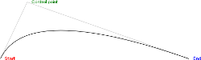

# Séance 6 - \<canvas\> 2D

**Date :** 12/02/2014 - 9h30 / 12h30 et 13h30 / 16h30

## Sommaire

* La balise \<canvas\>
* Le contexte bitmap
* Coordonnées 2D

## La balise \<canvas\>

La balise `<canvas>` est un élément apparu en HTML5 et aujourd'hui supporté par la grande majorité des navigateurs. Il fournit un surface de pixels sur laquelle il est possible de dessiner via une API JavaScript.

Par défaut, un `<canvas>` est un élément inline transparent mesurant 300x150 pixels.

    <canvas id="slate"></canvas>

La balise `<canvas>` accepte les attributs applicables à n'importe quelle balise HTML ainsi que `width` et `height`. Il est possible de définir un contenu alternatif pour les navigateurs ne supportant pas `<canvas>` de la même façon que pour un  `<object>`.

## Le contexte bitmap

La seule façon de modifier le contenu affiché par un `<canvas>` est d'utiliser l'API Javascript dédiée pour manipuler le contexte d'affichage bitmap qu'il représente.

La balise `<canvas>` est un élément du DOM, au même titre que n'importe quelle autre balise. Elle dispose cependant de quelques méthodes supplémentaires, permettant d'accéder au contexte bitmap qu'elle affiche :

* `getContext` : retourne un object représentant le contexte bitmap
* `toDataURL` : retourne le contenu affiché sérialisé sous forme d'une data-uri
* `toBlob` : retourne le contenu affiché sous forme d'un objet JavaScript de type Blob

Les fonctions de dessin sont accessibles depuis l'objet représentant le contexte bitmap. `<canvas>` supporte plusieurs types de contexte pour des modes de dessin différents.

    <canvas id="slate"></canvas>
    
    

Le contexte 2D est spécifié par le W3C [^2D-specification] et largement supporté. WebGL est une implémentation en JavaScript du standard OpenGL ES 2.0 spécifiée par Khronos Group [^webgl-specification] et n'est supportée que par les navigateurs les plus récents.  
Pour la suite du cours, nous ne nous intéresserons qu'au contexte 2D.

## Coordonnées 2D

<figure style="float: right">
  
  <figcaption>
    Coordonnées à l'intérieur d'un canvas 
    Source: <a href="http://www.alsacreations.com/tuto/lire/1484-introduction.html">alsacreations.com</a>
  </figcaption>
</figure>

Le point d'origine (0, 0) est situé dans le coin supérieur gauche.

L'axe des abscisses s'étire dans le sens de la largeur ; l'axe des ordonnées dans le sens de la hauteur.

À l'intérieur du canvas, les coordonnées sont exprimées en pixels.

## Dessiner dans un \<canvas\>

L'objet retourné par `getContext('2d')`[^CanvasRenderingContext2D] est littéralement le crayon avec lequel nous allons pouvoir dessiné sur l'espace de pixels contenu dans le canvas : en modifiant les valeurs des propriétés de l'objet, on influence l'effet produit par le prochain coup de crayon ; en appelant l'une des méthodes de l'objet, on donne ou prépare un coup de crayon.

### Choisir sa couleur

Deux propriétés du contexte permettent de contrôler la couleur appliquée :

* `strokeStyle` le style utilisé pour le tracé des lignes et des contours
* `fillStyle`, le style appliqué pour le remplissage des zones

C'est deux propriétés peuvent prendre comme valeur une chaine de caractère contenant une couleur CSS, mais aussi un dégradé ou un motif (que nous évoquerons plus tard).

A la création du canvas, la couleur définie pour ces deux propriétés est le noir.

### Tailler son crayon

L'épaisseur des lignes et des contours tracés peut être contrôlé en modifiant la valeur de l'attribut `lineWidth`. Par défaut, elle est définie à 1px.

Les propriétés `lineCap` et `lineJoin` contrôlent respectivement l'allure des lignes lorsqu'elles se terminent et lorsqu'elles s'enchainent.

### Un simple cadre

Parce qu'il s'agit d'une des formes géométriques les plus simples à décrire et sans doute parce que la balise `<canvas>` en est un elle-même, le rectangle bénéficie d'un traitement particulier dans l'API de dessin 2D et dispose de 3 méthodes dédiées :

* `fillRect` pour tracer un rectangle plein
* `strokeRect` pour tracer les contours d'un rectangle
* `clearRect` pour effacer une zone rectangulaire

Ces trois méthodes attendent les mêmes arguments :

    context.fillRect(x, y, width, height);
    // Où x et y sont les coordonnées du coin supérieur gauche

**Exercice 1 :** Drapeaux

Pour toutes les autres formes, il faudra passer par les méthodes de contructions de chemins.

### Le chemin le plus court

On dit souvent que le plus court chemin entre deux points est la ligne droite. C'est vrai également dans l'API de dessin 2D de `<canvas>` où il n'existe pas de méthode pour tracer des lignes. Pour tracer la diagonale de notre canvas par exemple, il sera donc nécessaire de construire le chemin décrivant cette diagonale avant d'en demander le tracé du contour.

    context.beginPath();                        // Démarre un nouveau chemin
    context.moveTo(0, context.canvas.height);   // Déplace le curseur en bas à gauche du canvas
    context.lineTo(context.canvas.width, 0);    // Ajoute au chemin une ligne reliant le point courant
                                                // au coin supérieur droit.
    
    context.stroke();                           // Trace le contour du chemin

**Exercice 2 :** Compositions

### Quelques détours

Les méthodes de constructions de chemins disponibles dans l'API de dessin 2D permettent de décrire des formes complexes avant d'en tracer les contours *- avec la méthode `stroke` -* ou de les remplir *- avec la méthode `fill` -*. À partir d'un nombre réduit de fonctions, il est possible de décrire toutes les formes géométriques, pas à pas.

Un triangle peut ainsi être décrit comme un chemin passant par trois points.

    // Démarre un nouveau chemin
    context.beginPath();
    
    // Déplace le curseur en bas à gauche du canvas
    context.moveTo(0, context.canvas.height);
    
    // Ajoute au chemin une ligne reliant le point courant
    // au point situé au milieu du bord supérieur
    context.lineTo(context.canvas.width / 2, 0);
    
    // Ajoute au chemin une ligne reliant le point courant
    // au point situé en bas à droite du canvas
    context.lineTo(context.canvas.width, context.canvas.height);
    
    // Ferme le chemin en reliant le point courant au point de départ
    context.closePath();
    
    // Trace le contour du chemin
    context.stroke();
    
    // Rempli l'espace délimité par le chemin
    // (Ceci est possible car notre chemin est clos)
    context.fill();

**Exercice 3 :** Polygones

### Virages serrés

Tous les chemins ne peuvent pas être décrits uniquement comme une succession de segments rectilignes, sous peine de nécessiter une infinité de segments pour décrire fidèlement un cercle. Heureusement, l'API de dessin 2D prévoit plusieurs méthodes pour tracer des courbes, régulières ou non.

La méthode `arc` permet d'ajouter un arc de cercle à un chemin.

    context.beginPath();
    context.arc(x, y, radius, startAngle, endAngle, counterClockwise);
    context.stroke();

<figure syle="float: right">
  
  <figcaption>
    Les paramètres de la méthode `arc` 
    Source : <a href="http://www.html5canvastutorials.com/tutorials/html5-canvas-arcs/">html5canvastutorials.com</a>
  </figcaption>
</figure>

Correspondance des arguments :

* `x`, l'abscisse du centre de l'arc de cercle
* `y`, l'ordonnée du centre de l'arc de cercle
* `radius`, le rayon de l'arc de cercle
* `startAngle`, l'angle de départ de l'arc de cercle, mesuré en radians par rapport à l'axe des abscisses
* `endAngle`, l'angle de fin de l'arc de cercle, mesuré en radians par rapport à l'axe des abscisses
* `counterClockwise`, un booléen indiquant si l'arc doit être tracé dans le sens anti-horaire ou non. Vaut `true par défaut`.

L'exemple ci-contre est obtenu en utilisant :

    context.beginPath();
    context.arc(
      context.canvas.width / 2,   // x
      context.canvas.height / 2,  // y
      75,                         // radius
      1.1 * Math.PI,              // startAngle
      1.9 * Math.PI,              // startAngle
      false                       // counterClockwise
      );
    context.stroke();

<figure syle="float: right">
  
  <figcaption>
    Fonctionnement de la méthode `arcTo` 
    Source : <a href="https://developer.mozilla.org/en-US/docs/Web/API/CanvasRenderingContext2D#arcTo%28%29">developer.mozilla.org</a>
  </figcaption>
</figure>

La méthode `arcTo` permet d'ajouter un arc de cercle à un chemin, en utilisant cette fois des points de contrôle pour guider la trajectoire.

    context.beginPath();
    context.arcTo(xc, yc, xa, ya, radius);
    // Avec (xc, yc) les coordonnées du point de contrôle
    // et (xa, ya) les coordonnées du point d'arrivée.
    
    context.stroke();

L'arc de cercle calculé sera relié au point précédent ainsi qu'au point d'arrivée par des lignes droites. Cette méthode est utiles pour tracers des coins arrondis.

<figure syle="float: right">
  
  <figcaption>
    Fonctionnement de la méthode `quadraticCurveTo` 
    Exemple interactif disponible sur <a href="http://www.rgraph.net/blog/2013/january/an-example-of-the-html5-canvas-quadraticcurveto-function.html">www.rgraph.net</a>
  </figcaption>
</figure>

Sur le même principe, la méthode `quadraticCurveTo` ajoute un segment au chemin qui sera calculé de façon à être tangent à deux droites, la première partant du point courant vers le point de contrôle et la seconde partant du point de contrôle vers le point d'arrivée.

    context.beginPath();
    context.moveTo(x0, y0);
    context.quadraticCurve(xc, yc, xa, ya);
    // Avec (xc, yc) les coordonnées du point de contrôle
    // et (xa, ya) les coordonnées du point d'arrivée.
    
    context.stroke();

<figure syle="float: right">
  
  <figcaption>
    Fonctionnement de la méthode `bezierCurveTo` 
    Exemple interactif disponible sur <a href="http://cubic-bezier.com/">cubic-bezier.com</a>
  </figcaption>
</figure>

Enfin, la méthode `bezierCurveTo` crée un nouveau segment de chemin qui suit une courbe de Bézier cubique.

    context.beginPath();
    context.moveTo(x0, y0);
    context.quadraticCurve(xc1, yc1, xc2, yc2, xa, ya);
    // Avec (xc1, yc1) les coordonnées du premier point de contrôle,
    // (xc2, yc2) les coordonnées du second point de contrôle
    // et (xa, ya) les coordonnées du point d'arrivée.
    
    context.stroke();

**Exercice 4 :** Courbes

[^2D-specification]: <http://www.w3.org/TR/2dcontext/>
[^webgl-specification]: <https://www.khronos.org/registry/webgl/specs/1.0/>
[^CanvasRenderingContext2D]: <https://developer.mozilla.org/en-US/docs/Web/API/CanvasRenderingContext2D>

[^canvas-cheat-sheet]: <http://www.nihilogic.dk/labs/canvas_sheet/HTML5_Canvas_Cheat_Sheet.pdf>